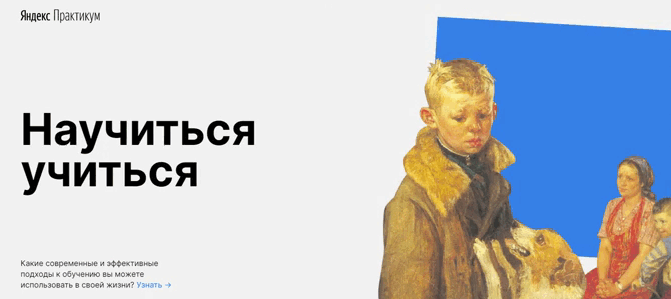

#  Проект «Научиться учиться»
**[Ссылка на проект](https://geniav.github.io/how-to-learn/index.html)**

Первый учебный проект по статичной верстке. **Задача:** научиться верстать, описывать стили, использовать методологию БЭМ.

**STACK**

HTML, CSS, BЭM.

**ОПИСАНИЕ**

**Учебный проект** представляет собой статичную страницу с простой анимацией.

**ЗАПУСК ПРОЕКТА**

   | Вариант | Описание |
| ------ | ------ |
| 1 | запуск из папки проекта _(файл index.html)_ |
| 2 | запуск в VSCode при помощи расширения [LiveServer](https://marketplace.visualstudio.com/items?itemName=ritwickdey.LiveServer) |
